# Build an Observability Dashboard for IBM Maximo SRE with IBM Instana and IBM BOB

This tutorial walks through how to configure IBM Instana for a Maximo OpenShift cluster and then use IBM BOB to accelerate the creation of a production-ready observability dashboard for Maximo SRE teams.

The goal is to help SRE, platform, and application teams move from raw telemetry to an actionable dashboard that tracks service health, latency, errors, call volume, and SLO status for the Maximo Manage application.

## What you will build

You will build an observability dashboard that:

- Connects a Maximo OpenShift cluster to IBM Instana.
- Validates Kubernetes and service telemetry in Instana.
- Creates a Maximo Manage application perspective in Instana.
- Uses IBM BOB to generate a production-ready dashboard application.
- Uses Instana REST APIs to retrieve application, service, call-group, and metrics data.
- Displays Maximo SRE metrics through a Python Dash and Plotly-based user interface.
- Can be containerized with Docker and deployed to IBM Code Engine.

## Business value

For Maximo SRE teams, observability helps reduce operational blind spots across distributed workloads. It supports proactive issue detection, faster root-cause analysis, better SLA and SLO tracking, improved capacity planning, and reduced operational overhead.

IBM BOB adds value by reducing the manual effort required to create dashboards. Instead of manually configuring each widget, filter, query, and visualization, teams can use natural language prompts to generate consistent dashboard code and documentation based on the target application and telemetry pattern.

## Target architecture

The solution connects the Maximo OpenShift cluster to Instana through the Instana agent. Instana collects telemetry from the cluster and application services. IBM BOB is then used to generate the dashboard application code, which consumes Instana APIs and presents SRE-focused insights to users.

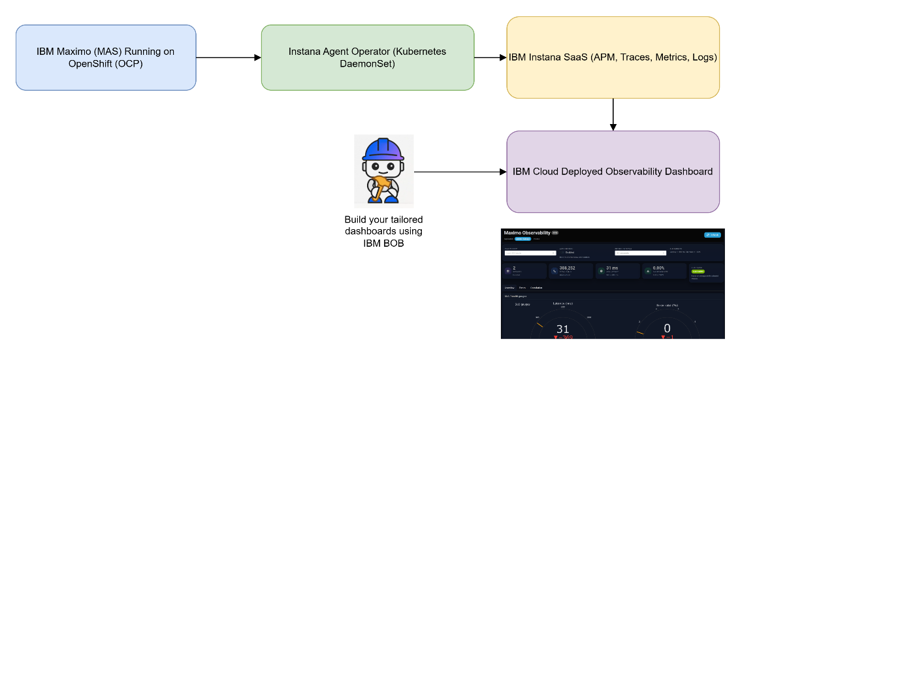

## Prerequisites

Before you begin, make sure you have:

- IBM Maximo deployed on OpenShift.
- Cluster-admin access to the OpenShift cluster.
- IBM Instana SaaS account.
- Instana API token.
- Instana agent key.
- Instana download key.
- IBM BOB access credentials.
- IBM Cloud account for deployment.
- IBM Cloud CLI, Docker, and the Code Engine plugin if you plan to deploy the dashboard.

## Step 1. Install the Instana agent operator

Install the Instana agent operator in the OpenShift cluster where Maximo is running.

```bash
kubectl apply -f https://github.com/instana/instana-agent-operator/releases/latest/download/instana-agent-operator.yaml
```

The Instana operator installation flow provides the cluster details, namespace, and YAML configuration needed for the agent.

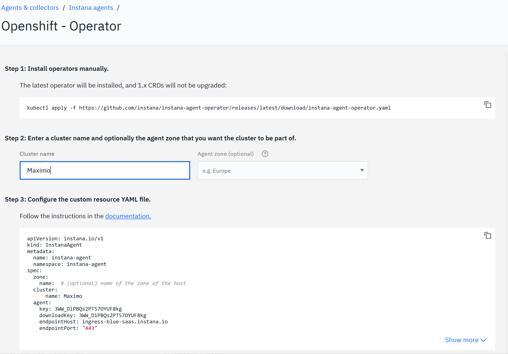

## Step 2. Configure the Instana agent

Create or apply an `InstanaAgent` custom resource with your Instana agent key, download key, endpoint host, and cluster name.

```yaml
apiVersion: instana.io/v1
kind: InstanaAgent
metadata:
  name: instana-agent
  namespace: instana-agent
spec:
  zone:
    name: ""
  cluster:
    name: Maximo
  agent:
    key: <agent_key>
    downloadKey: <download_key>
    endpointHost: <instana_host>
    endpointPort: "443"
    env: {}
    configuration_yaml: |
      # Optional custom Instana agent configuration.
```

Replace the placeholders before applying the YAML:

- `<agent_key>`: Instana agent key.
- `<download_key>`: Instana download key.
- `<instana_host>`: Instana endpoint host.

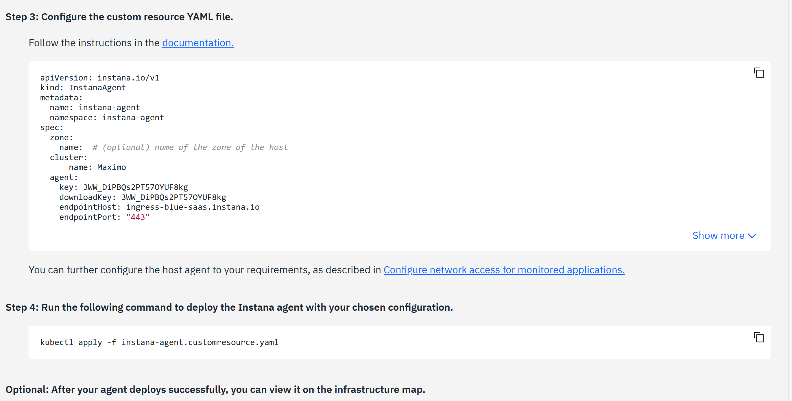

Apply the resource:

```bash
kubectl apply -f instana-agent.yaml
```

Validate that the agent pods are running:

```bash
kubectl get pods -n instana-agent
```

## Step 3. Log in to Instana

After the agent connects, log in to Instana and confirm that the cluster appears in the infrastructure view.

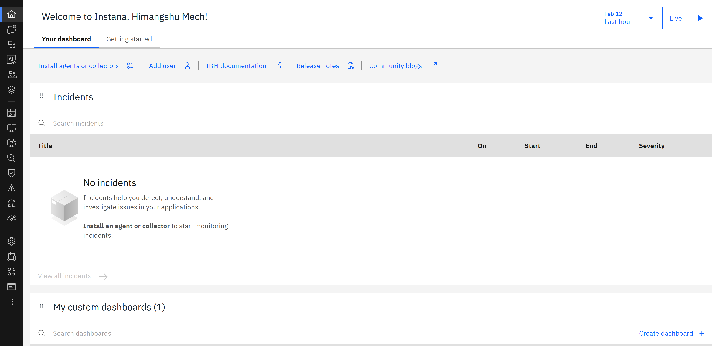

## Step 4. Validate the Maximo OpenShift cluster in Instana

Open the infrastructure section and confirm that the Maximo OpenShift cluster is visible.

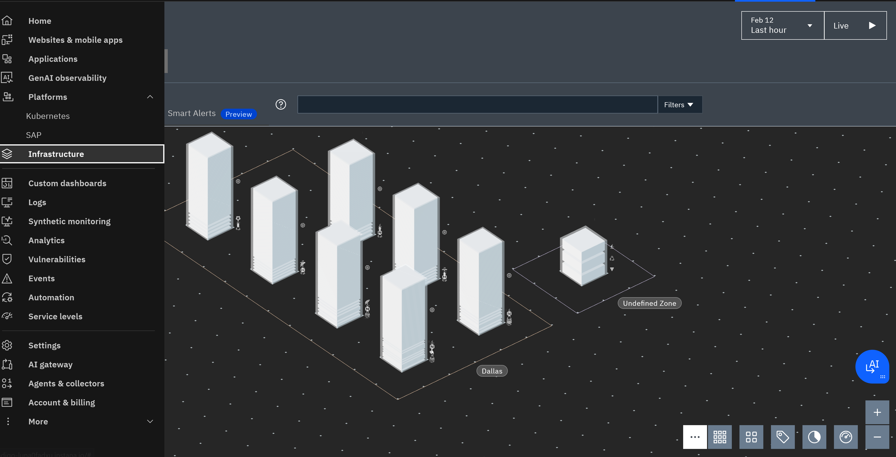

To validate Kubernetes-level telemetry, go to **Platform > Kubernetes** and confirm that the cluster details, workloads, namespaces, services, and core metrics are available.

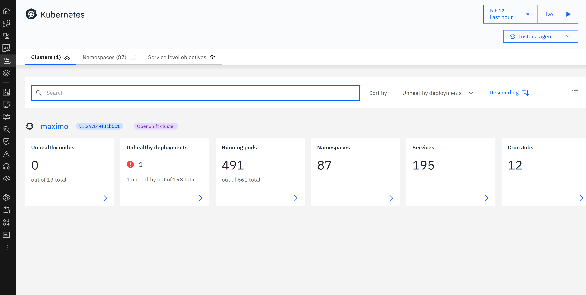

## Step 5. Review Maximo service telemetry

After Kubernetes telemetry is available, review the services detected for the Maximo environment. This confirms that Instana is receiving application-level telemetry that can later be used for dashboard creation.

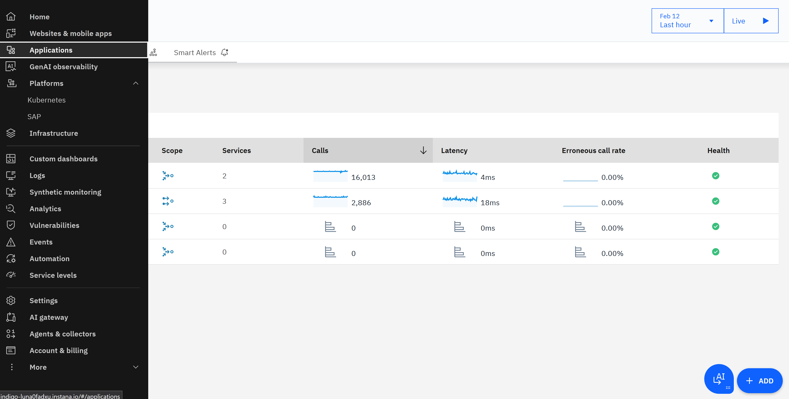

## Step 6. Create a Maximo Manage application perspective

In Instana, create a new application perspective for Maximo Manage.

1. Click **Add** from the bottom-right menu.
2. Select **New application perspective**.
3. Switch to **Advanced mode** if you need more control over the rules.
4. Create the application perspective using the name `Maximo-Manage`.

Use the same application name later in the IBM BOB prompt and dashboard environment configuration.

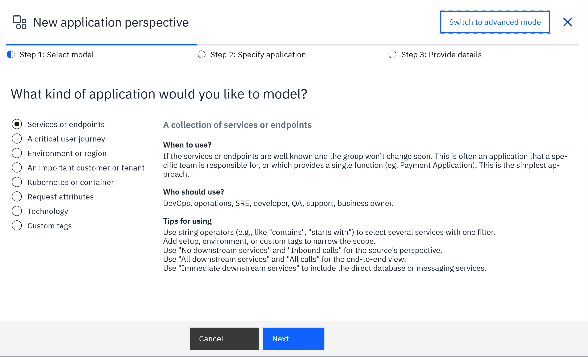

Define the application perspective rules so that the relevant Maximo services are included.

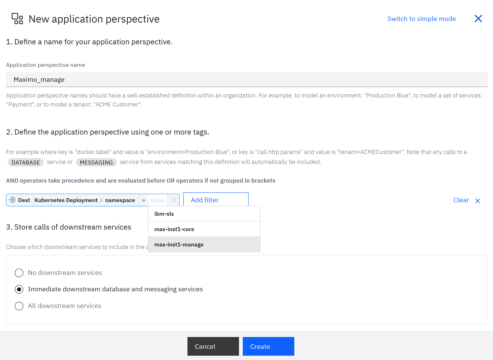

After creation, confirm that `Maximo-Manage` appears under the application menu.

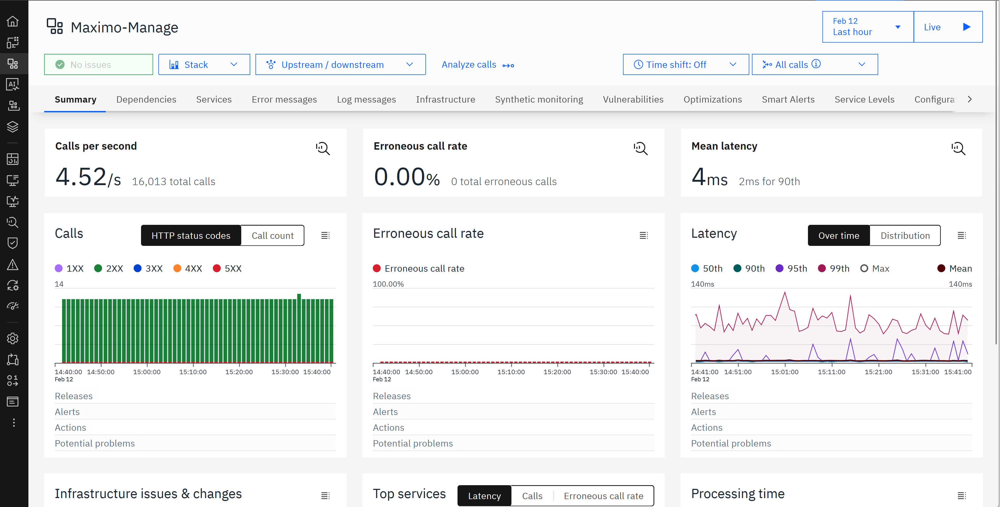

## Step 7. Use IBM BOB to generate the dashboard application

Open IBM BOB and create or open a workspace for the dashboard project. The purpose of using IBM BOB is to reduce the manual work required to build and wire the dashboard application, API client, styling, containerization, and deployment scripts.

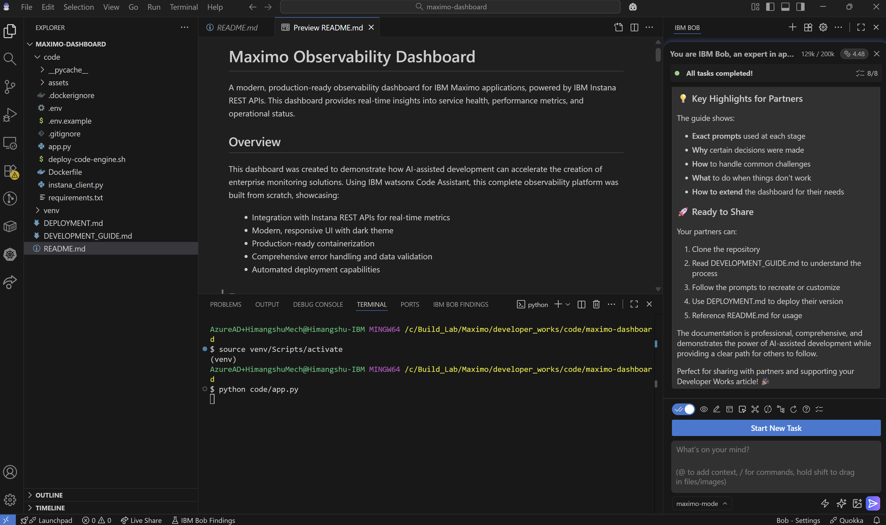

Use the following prompt in IBM BOB.

```text
I need to build a production-ready observability dashboard for monitoring IBM Maximo applications using IBM Instana REST APIs. Please help me create this step by step.

PROJECT REQUIREMENTS:

1. PROJECT STRUCTURE:
- Create a folder called "maximo-dashboard".
- Inside it, create a "code" subfolder for all application code.
- Place documentation files such as README.md and DEPLOYMENT.md at the root level.

2. TECHNOLOGY STACK:
- Python Dash framework for the web application.
- Plotly for interactive visualizations.
- Pandas for data processing.
- Requests library for API calls.
- Docker for containerization.
- IBM Code Engine for deployment.

3. INSTANA API INTEGRATION:
Create an Instana API client named instana_client.py that:
- Connects to Instana REST APIs using base URL and API token.
- Implements these endpoints:
  - GET /api/application-monitoring/applications
  - GET /api/application-monitoring/applications;id={id}/services
  - POST /api/application-monitoring/analyze/call-groups
  - POST /api/application-monitoring/metrics/services

CRITICAL:
Instana returns metrics in this format:
{"metric.aggregation": [[timestamp, value]]}

Example:
{"calls.sum": [[1720080000000, 200]], "errors.mean": [[1720080000000, 0.5]]}

Create a safe extraction function that:
- Handles the [[timestamp, value]] format correctly.
- Returns default values if extraction fails.
- Handles None, empty lists, and malformed data.
- Prevents division by zero.
- Handles NaN values in pandas DataFrames.

4. DASHBOARD APPLICATION:
Create app.py using Dash with:
- A modern dark theme.
- Purple-blue gradient from #667eea to #764ba2.
- Background color #0a0e27.
- Success color #10b981.
- Warning color #f59e0b.
- Danger color #ef4444.
- Semi-transparent cards with backdrop blur.
- Smooth hover animations.
- Rounded corners of 16px.

LAYOUT:
- Three tabs: Overview, Services, Metrics.
- Four KPI cards:
  - Total Services.
  - Total Calls.
  - Average Latency.
  - Error Rate.

COLOR THRESHOLDS:
- Average latency: green below 200 ms, yellow between 200 and 500 ms, red above 500 ms.
- Error rate: green below 0.5%, yellow between 0.5% and 2%, red above 2%.

CHARTS:
- Service health overview.
- Call volume by service.
- Error rate by service.
- Latency by service.
- Call distribution donut chart.
- Error vs latency scatter plot.
- Service health score.
- Processing time breakdown.
- Time-series trend charts.

FEATURES:
- Auto-refresh toggle, default off, interval 60 seconds.
- Time window selector for 1h, 6h, 24h, and 7d.
- Service drill-down modal.
- SLO status indicator.
- Loading indicators.
- User-friendly error messages.

5. CONFIGURATION:
Read these values from environment variables:
- INSTANA_BASE_URL, required.
- INSTANA_API_TOKEN, required.
- FIXED_APPLICATION_NAME, default maximo-manage.
- SLO_LATENCY_MS, default 400.
- SLO_ERROR_RATE_PCT, default 1.0.
- AUTO_REFRESH_DEFAULT, default false.
- AUTO_REFRESH_SECONDS, default 60.
- DASH_HOST, default 0.0.0.0.
- DASH_PORT, default 8080.

6. STYLING:
Create assets/dashboard.css with:
- Glass morphism card effects.
- Gradient backgrounds and text.
- Smooth transitions.
- Hover effects using transform: translateY(-4px).
- Responsive and mobile-friendly layouts.

7. DOCKER CONTAINERIZATION:
Create a Dockerfile with:
- Multi-stage build.
- Python 3.11 slim base image.
- Non-root appuser.
- Optimized layer caching.
- Health check endpoint.
- Port 8080 exposed.

Create a .dockerignore file to exclude:
- Python cache.
- Virtual environments.
- .env files.
- Documentation.
- Git and IDE files.

8. DEPLOYMENT AUTOMATION:
Create deploy-code-engine.sh that:
- Validates IBM Cloud CLI, Docker, and Code Engine plugin.
- Prompts for container registry namespace, Instana URL, and API token.
- Builds and pushes the Docker image.
- Creates or updates the Code Engine application.
- Displays the dashboard URL.
- Includes error handling and status messages.

9. DOCUMENTATION:
Create README.md with:
- Project overview.
- Feature list.
- Architecture description.
- Quick start guide.
- Configuration reference.
- Project structure diagram.
- Development with IBM BOB or watsonx Code Assistant.
- Troubleshooting guide.
- Security considerations.

Create DEPLOYMENT.md with:
- Prerequisites.
- Automated and manual deployment options.
- Configuration details.
- Monitoring and maintenance.
- Security best practices.
- Troubleshooting.
- CI/CD integration example.
- Cost optimization tips.

10. QUALITY REQUIREMENTS:
- Use comprehensive try-catch blocks.
- Handle API failures.
- Validate data before rendering charts.
- Provide user-friendly error messages.
- Include logging for debugging.
- Handle empty data, zero values, and NaN values.
- Keep API tokens in environment variables only.
- Do not log sensitive data.
- Use HTTPS communication.
- Use a minimal container image.

IMPORTANT:
- Focus only on the Maximo-Manage application.
- Handle Instana paginated responses where data is returned in response["items"].
- Extract metrics correctly from the [[timestamp, value]] format.
- Use consistent color coding for health indicators.
- Make all charts interactive with hover tooltips.
- Ensure production-ready code quality.
- Include comprehensive documentation.

Please build this step by step, starting with the project structure and API client, then the dashboard application, styling, containerization, deployment automation, and documentation. Pause after each major component for validation before proceeding.
```

## Step 8. Validate the generated project structure

After IBM BOB generates the application, validate that the project structure looks similar to this:

```text
maximo-dashboard/
├── README.md
├── DEPLOYMENT.md
├── .env.example
├── .gitignore
├── .dockerignore
├── Dockerfile
├── deploy-code-engine.sh
└── code/
    ├── app.py
    ├── instana_client.py
    ├── requirements.txt
    └── assets/
        └── dashboard.css
```

## Step 9. Configure dashboard environment variables

Create a `.env` file or configure environment variables in the runtime environment.

```bash
INSTANA_BASE_URL=https://<your-instana-host>
INSTANA_API_TOKEN=<your-instana-api-token>
FIXED_APPLICATION_NAME=Maximo-Manage
SLO_LATENCY_MS=400
SLO_ERROR_RATE_PCT=1.0
AUTO_REFRESH_DEFAULT=false
AUTO_REFRESH_SECONDS=60
DASH_HOST=0.0.0.0
DASH_PORT=8080
```

Do not commit `.env` files or API tokens to Git.

## Step 10. Run the dashboard locally

From the generated application folder, install dependencies and start the dashboard.

```bash
cd maximo-dashboard/code
python -m venv .venv
source .venv/bin/activate
pip install -r requirements.txt
python app.py
```

Open the dashboard in a browser using the configured host and port.

## Step 11. Review dashboard output

The dashboard should show KPIs such as services, calls, average latency, and error rate. It should also provide SLO indicators and charts for service health, call volume, latency, error rate, and processing time.

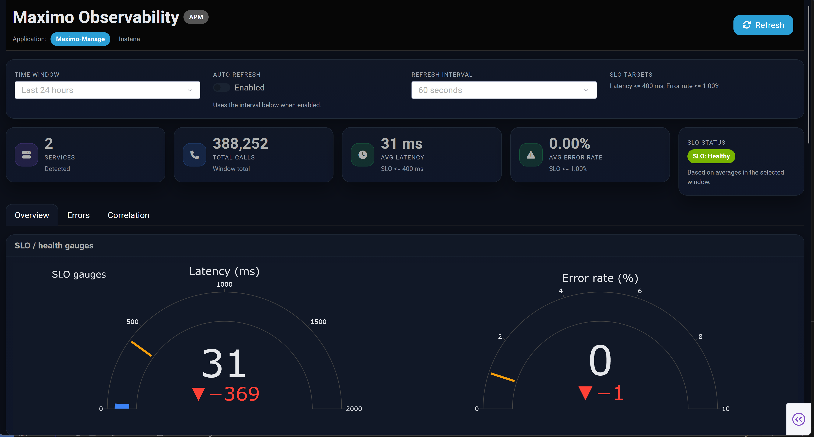

Use the KPI panel to quickly understand the operational state of the Maximo application.

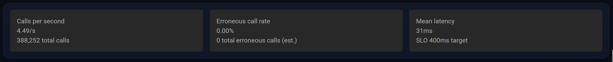

## Step 12. Containerize the application

Build the Docker image from the generated project root.

```bash
docker build -t maximo-dashboard:latest .
```

Run the container locally:

```bash
docker run --rm -p 8080:8080 \
  -e INSTANA_BASE_URL="https://<your-instana-host>" \
  -e INSTANA_API_TOKEN="<your-instana-api-token>" \
  -e FIXED_APPLICATION_NAME="Maximo-Manage" \
  maximo-dashboard:latest
```

## Step 13. Deploy to IBM Code Engine

Use the generated deployment script if IBM BOB created it as requested.

```bash
chmod +x deploy-code-engine.sh
./deploy-code-engine.sh
```

The script should build the image, push it to IBM Cloud Container Registry, create or update the Code Engine application, and print the dashboard URL.

## Operational considerations

### Security

- Store Instana API tokens as environment variables or platform secrets.
- Do not hardcode secrets in application code.
- Do not log API tokens or sensitive headers.
- Use a non-root container user.
- Use HTTPS for all Instana API communication.

### Reliability

- Add retry and timeout handling for Instana API calls.
- Gracefully handle missing metrics, empty responses, malformed metric payloads, and API failures.
- Add health checks for the dashboard container.
- Use SLO thresholds to highlight service risk quickly.

### Data handling

- Normalize metric values before charting.
- Prevent division by zero.
- Handle `NaN` values before rendering charts.
- Filter charts to top services when there is a large number of services.

## Troubleshooting

| Issue | What to check |
| --- | --- |
| Instana cluster is not visible | Verify the agent key, download key, endpoint host, namespace, and pod status. |
| Kubernetes data is visible but application data is missing | Confirm Maximo services are instrumented and that the application perspective rules include the correct services. |
| Dashboard shows empty charts | Verify `FIXED_APPLICATION_NAME`, Instana API token permissions, API response format, and time window. |
| Metrics extraction fails | Confirm the code handles Instana metric payloads in the `[[timestamp, value]]` format. |
| Deployment fails | Verify IBM Cloud login, container registry namespace, Code Engine project, image push permissions, and environment variables. |

## Summary

By combining IBM Maximo, IBM Instana, and IBM BOB, SRE teams can move faster from telemetry setup to business-relevant operational dashboards. Instana provides the observability data, and IBM BOB accelerates the creation of the dashboard application, API integration, styling, deployment automation, and documentation.
